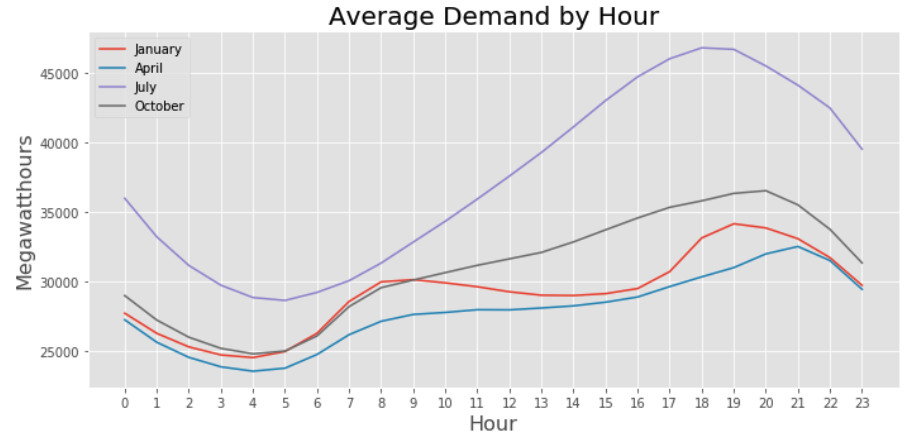

# Predicting Hourly Electricity Demand for California

Electricity use can vary dramatically throughout the day. Providers need to be able to predict demand beforehand so that they have time to turn plants on if demand is going to be high or save money by shutting them down if demand is going to be low. I used the U.S. Energy Information Administration's (EIA) historical demand data for California to predict by hour demand levels for the next day, next three days, and next week.

## Exploring The Data

The data in EIA's starts July 1, 2015 and is updated every day. Demand is given for every hour producing a time series with over 45,000 points of data. The data and instructions for connecting to EIA's API can be found [here](https://www.eia.gov/opendata/qb.php?category=3389936&sdid=EBA.CAL-ALL.D.HL).

To help me build my models, I extracted the hour, day of the week, month, and year values from the timestamp. For certain models, like Linear Regression, Random Forest Regressor, and Gradient Boosting Regressor, I dummified these columns. For my Long Short-Term Memory (LSTM) model, I normalized the demand data.

I also had a few outliers as shown on the graph on the left below. I assume that demand did not actually dip below 15,000 megawatthours at these times and that there was an issue with supply. I decided to replace these points using the average demand for the same hour, day of week, and month. The graph on the right below shows the resulting series.

Next, I wanted to examine the elements making up this series. The graphs below show the series' trend, seasonal, and residual components. This series does not have much of a trend, but it does have a strong seasonal component.

Lastly, I wanted to view the impact hour, day of week, month, and year had on the series. Below shows the mean, maximum and minimum for each year, month, day of week, and hour.

Because hour and month have the most impact on the variation in the data, I wanted to see if hourly demand changed by month. Below is a graph showing the average demand by hour for four months- January, April, July, and October. We can see that month does affect hourly demand. For instance, peak energy use is much later in the day in April than it is for July.

## Modeling

Because this data is a time series, order matters so I could not do a traditional cross validation and split my data many times to train and test it. Instead I picked five dates and predicted seven days out (168 hours). I took the average root mean squared error (RMSE) to score my models. For my baseline model, I took the average of the last seven days. I also tried using the last week as my predictions and using the same week last year. I also tried a couple regression models: Linear, Lasso, Ridge, Random Forest Regressor, and Gradient Boosting Regressor. Lastly, I tried a neural network model, Long Short-Term Memory (LSTM).

For my Lasso and Ridge models, I wrote a function to search for the best alpha value. For my Random Forest and Gradient Boosting models, I performed a grid search to find the optimal number of estimators, max tree depth, minimum number of samples before splitting a node, and in the case of Gradient Boosting, learning rate. For my LSTM model, I tried different number of nuerons, different dropout rates, and varied the length of my X values sequence. I also tried predicting a single output at a time vs predicting a sequence of outputs.

Train Results:

My models that did the best on average tended to do the worst when predicting the hardest week in July.

Test Results:

## Next Steps

- Add weather data as another feature.
- Combining models to make predictions since different models seem to do better for different time periods.
- Try more LSTM variations. Try adding another layer.
- Make interaction dummies for month and hour

## Tools Used

- Main Python Libraries
  - pandas
  - numpy
  - matplotlib
  - requests
  - sklearn
    - RandomForestClassifier
    - GradientBoostingClassifier
  - tensorflow.keras
    - LSTM
- AWS SageMaker

## Code Files

